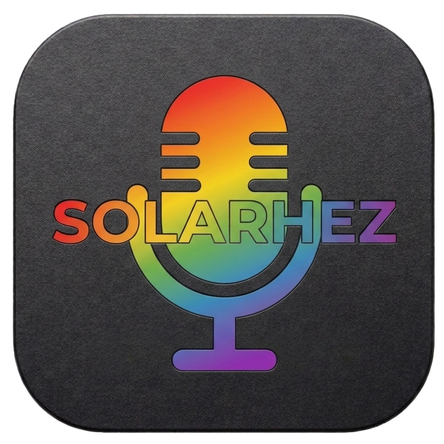
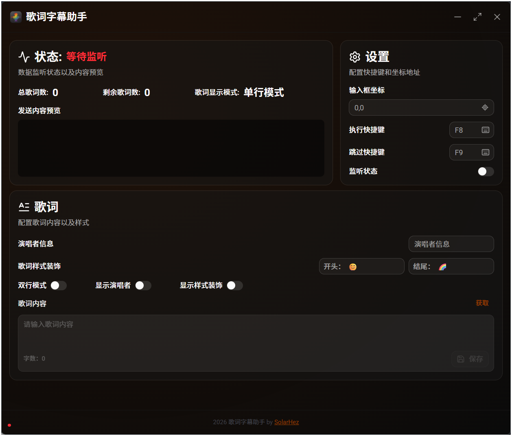

#  歌词字幕助手

<p align="center">
  <em>一个现代化的桌面应用程序，用于处理歌词和字幕相关任务</em>
</p>

<p align="center">
  <a href="#技术栈">
    
  </a>
  <a href="#技术栈">
    
  </a>
  <a href="#技术栈">
    
  </a>
  <a href="#许可证">
    
  </a>
</p>

## 📷 截图预览

<div align="center">



</div>

## 📋 项目概述

歌词字幕助手是一个现代化的桌面应用程序，旨在帮助用户轻松处理歌词和字幕相关的工作。该应用利用 **Tauri** 框架提供原生桌面体验，结合 **React** 构建现代化的用户界面，为用户提供流畅的操作体验。

<div align="center">

### ✨ 特性亮点

| 🚀 性能      | 🎨 界面      | 🔧 功能  |
| ------------ | ------------ | -------- |
| 原生桌面应用 | 现代化UI设计 | 实时监控 |
| 高效响应     | 响应式布局   | 窗口控制 |
| 低资源占用   | 主题适配     | 字幕处理 |

</div>

## 🛠️ 技术栈

<div align="center">

| 技术             | 描述         | 版本   |
| ---------------- | ------------ | ------ |
| **React**        | 前端UI框架   | 19.1.0 |
| **TypeScript**   | 类型安全语言 | 5.8.3  |
| **Tauri**        | 桌面应用框架 | 2.x    |
| **Tailwind CSS** | 样式框架     | 4.3.0  |
| **Vite**         | 构建工具     | 7.0.4  |
| **Radix UI**     | UI 组件库    | -      |

</div>

## 🌟 功能特性

- ✅ **实时监控状态显示** - 清晰的状态指示器，便于了解应用运行情况
- 🖥️ **窗口控制功能** - 完整的窗口操作控制
- ⚙️ **设置面板** - 灵活的配置选项
- ✏️ **编辑功能** - 强大的编辑能力
- 🌙 **主题适配系统** - 支持浅色/深色模式自动切换
- ⚡ **桌面级性能** - 利用Tauri框架提供原生性能

## 🚀 快速开始

### 环境要求

- [Node.js](https://nodejs.org/) >= 18.0.0
- [pnpm](https://pnpm.io/) (推荐) 或 npm

### 安装步骤

1. **克隆仓库**

   ```bash
   git clone <repository-url>
   cd ferris-click
   ```

2. **安装依赖**

   ```bash
   pnpm install
   # 或者使用 npm
   npm install
   ```

3. **启动开发服务器**

   ```bash
   pnpm dev
   # 或者使用 npm
   npm run dev
   ```

4. **构建生产版本**

   ```bash
   pnpm build
   # 或者使用 npm
   npm run build
   ```

## 📁 项目结构

```
ferris-click/
├── src/                 # 源代码目录
│   ├── components/       # 可复用UI组件
│   ├── layout/           # 页面布局组件
│   ├── page/             # 应用页面
│   ├── hooks/            # 自定义React Hooks
│   ├── lib/              # 工具函数库
│   └── assets/           # 静态资源
├── public/              # 静态资源
├── package.json         # 项目配置
├── vite.config.ts       # Vite配置
└── tsconfig.json        # TypeScript配置
```

## 👤 开发者

由 [SolarHez](https://github.com/SolarHez) 开发维护

## 📄 许可证

本项目采用 [MIT 许可证](LICENSE)。

---

<div align="center">

<a href="#歌词字幕助手">
  <sub>回到顶部 ↑</sub>
</a>

</div>
